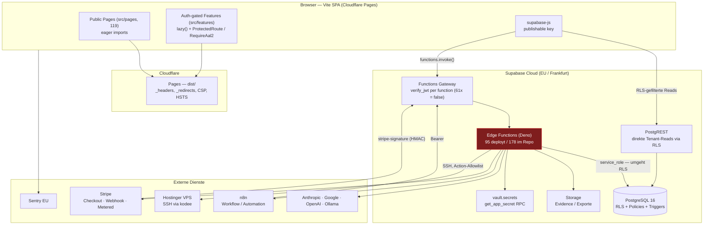

# 01 — System Map

**Audit-Datum:** 2026-08-10 · **Commit:** `6f5ca5c` · **Ziel:** https://realsyncdynamicsai.de
**Supabase-Projekt (prod):** `ebljyceifhnlzhjfyxup.supabase.co` (aus dem ausgelieferten Bundle)

---

## 1. Ist-Stand (verifiziert, nicht dokumentiert)

| Schicht | Technologie | Belegt durch |
|---|---|---|
| Build | Vite 6.2 → `dist/` | `vite.config.ts`, `package.json` |
| UI | React 19 + TS 5.8 (`strict: true`) | `tsconfig.json`, `npm run lint` = exit 0 |
| Routing | react-router-dom 7.17 (Client-Side) | `src/App.tsx` |
| Styling | Tailwind 4.1 via `@tailwindcss/vite` | `tailwind.config.ts` |
| Hosting | Cloudflare Pages | `wrangler.toml` (`pages_build_output_dir = "dist"`), Response-Header `server: cloudflare` |
| Backend | Supabase Cloud (EU) — PostgreSQL 16 + Edge Functions (Deno) | `supabase/config.toml` |
| Edge Functions | **178 im Repo · 95 in Produktion · 83 nicht deployt** | Live-`OPTIONS`-Probe, siehe §4 |
| Migrations | **270 im Repo · Teilmenge in Produktion** | `docs/runbooks/p0-2-migration-reconciliation.md` (118/244 offen), Live-PostgREST-Probe |
| Auth | Supabase Auth (Email/Passwort + OAuth), AAL2 vorhanden | `src/features/auth/`, `RequireAal2` |
| Billing | Stripe (npm `stripe@16.12.0` in Deno) | `supabase/functions/stripe-webhook` |
| Monitoring | Sentry 8.55 (EU-Ingest) | `src/lib/sentry.ts`, CSP erlaubt `*.ingest.de.sentry.io` |
| AI-Provider | Anthropic, Google GenAI, OpenAI, Ollama | 18 Edge Functions mit `ANTHROPIC_API_KEY` |
| Automation | n8n (Callbacks mit Shared-Secret) | `workflow-callback`, `automation-callback` |
| VPS-Ops | SSH aus Edge Function (`kodee`) | `supabase/functions/kodee/ssh.ts` |
| Tests | Vitest 3067 Tests · Playwright 47 Specs | `npm test` = 2867 passed |

**Bestätigt:** kein Next.js, kein `app/`-Verzeichnis, keine Server Components, kein Go.
**Abweichung von CLAUDE.md:** `vercel.json` existiert im Root (siehe FINDING F-13).

---

## 2. Architekturdiagramm



**Rot markiert:** die Edge-Function-Schicht ist der zentrale Bruch — 47 % des Codes
erreicht die Produktion nicht (siehe `18_FINDINGS.md`, F-01).

---

## 3. Vertrauensgrenzen

| # | Grenze | Kontrolle | Bewertung |
|---|---|---|---|
| T1 | Browser → PostgREST | RLS über `memberships`/`tenant_memberships` | ✅ live verifiziert: anonym 0 Zeilen auf allen Kern-Tabellen |
| T2 | Browser → Edge Function | `verify_jwt` (Gateway) **oder** manuelle Prüfung in der Function | ⚠️ inkonsistent — 61 Functions mit `verify_jwt = false`, davon 18 ohne jede Prüfung |
| T3 | Edge Function → PostgreSQL | `service_role` — umgeht RLS vollständig | ⚠️ Autorisierung liegt allein im Function-Code; nicht überall vorhanden |
| T4 | n8n → Edge Function | Shared Bearer Secret | ✅ `workflow-callback`, `automation-callback` korrekt |
| T5 | Stripe → Edge Function | HMAC-Signaturprüfung + Idempotenz | ✅ vorbildlich (`constructEventAsync`) |
| T6 | Edge Function → VPS | JWT + Action-Allowlist + `shellQuote()` | ✅ solide |
| T7 | Externer Ingest → Runtime | `rsd_gov_`-Key, sha256-Hash-Lookup | ✅ korrekt |

---

## 4. Deployment-Realität (Live-Probe, 2026-08-10)

Methode: `OPTIONS https://<ref>.supabase.co/functions/v1/<name>` — nebenwirkungsfrei.
`404` = nicht deployt, alles andere = deployt.

```
DEPLOYT:        95 / 178   (53 %)
NICHT DEPLOYT:  83 / 178   (47 %)
```

Nicht deployt sind unter anderem **vollständige Produktmodule**:

| Modul | Fehlende Functions |
|---|---|
| Evidence Vault | `evidence-vault`, `iso42001-evidence-vault`, `export-audit`, `audit-determinism-verify`, `governance-evidence-handler` |
| Policy Packs | `policy-packs` |
| Provenance / C2PA | `provenance`, `c2pa-manifest-generate` |
| Memory Governance (RFC-003) | `governance-memory`, `memory-decay-worker`, `memory-confidence-trigger` |
| ISO 42001 | `iso42001-controls-library`, `iso42001-control-detail`, `iso42001-gap-analysis`, `iso42001-evidence-vault` |
| SiteOS | `siteos-builder`, `siteos-agents`, `siteos-runtime-scan` |
| Öffentliche API | `api-gateway`, `api-audit`, `oauth2-apps`, `oauth2-token` |
| Webhooks | `webhook-deliver`, `webhook-dispatcher`, `webhook-retry-cron`, `api-webhook-deliver` |
| Scheduler | `scheduler`, `scheduler-dispatch`, `agent-scheduler`, `schedule-data-syncs` |
| White Label | `tenant-branding-get`, `tenant-branding-update` |
| Partner Mode | `partner-provision-tenant` |
| Reports | `report-generator`, `generate-compliance-report`, `governance-audit-report-gen`, `generate-certification-report` |
| Billing (Ergänzungen) | `create-trial-subscription`, `stripe-checkout-verify`, `stripe-oauth-callback`, `invoice-email` |
| Bulk Jobs | `bulk-scan` |
| Plan-Katalog-API | `plans` |

**33 dieser Functions werden vom Frontend aktiv aufgerufen** → direkt sichtbare Fehler
für eingeloggte Nutzer (siehe `09_API_AUDIT.md`).

---

## 5. Datenbank-Realität (Live-Probe via PostgREST)

Vorhanden: `tenants`, `memberships`, `governance_assets`, `governance_events`,
`runtime_events`, `ai_evidence_events`, `provenance_records`, `dsr_requests`,
`findings`, `scan_runs`, `products`, `subscriptions`, `document_vault`, `profiles`.

**Fehlend in Produktion (`PGRST205`):**
`evidence_vault_items` · `policy_pack_catalog` · `governance_memory` ·
`audit_jobs` · `entitlement_grants` · `iso_control_definitions` ·
`website_projects` · `governance_incidents` · `organizations` ·
`organization_members` · `integrations` · `memory_retention_policies` · `_rate_limits`

`entitlement_grants` und `governance_incidents` sind besonders kritisch —
siehe `05_BILLING_MATRIX.md` und F-03.

---

## 6. CI/CD

| Workflow | Läuft | Deckt ab |
|---|---|---|
| `ci.yml` | ✅ | Typecheck, Edge-Syntax, Unit-Tests, Build, Migrations-Validierung |
| `deploy-cloudflare-pages.yml` | ✅ | Frontend → Pages |
| `edge-function-drift.yml` | ⚠️ | **No-op ohne `SUPABASE_ACCESS_TOKEN`** — deshalb blieb die 83-Function-Lücke unentdeckt |
| `migration-reconciliation.yml` | offen | Runbook `p0-2` noch nicht ausgeführt |
| **DB-Tests (`test:db`)** | ❌ | **Läuft in keinem Workflow** — 18 Sicherheits-Tests (RLS, Hash-Chain, Append-Only) ungenutzt |
| **E2E (Playwright)** | ❌ | **Läuft in keinem Workflow** — 47 Specs ungenutzt |
