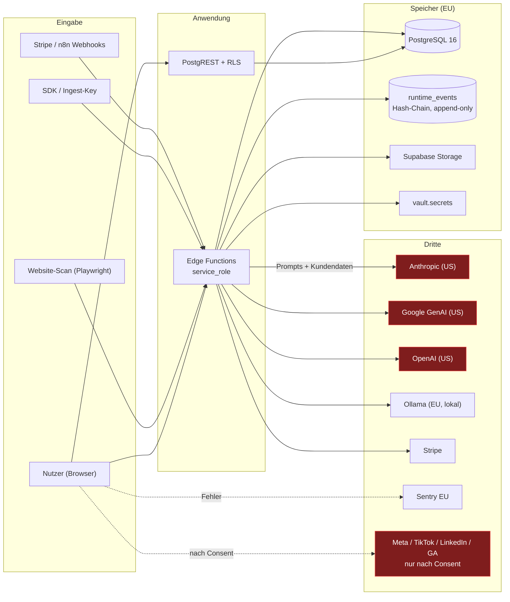

# 07 — Data Flow Map

## 1. Datenklassen

| Klasse | Beispiele | Speicherort |
|---|---|---|
| PII | `profiles.email`, `dsr_requests.requester_email/name` | PostgreSQL |
| Sensible PII | `tax_documents`, `enterprise_ai_system_registry.contains_sensitive_data` | PostgreSQL (**35 Tabellen ohne RLS → F-08**) |
| Pseudonymisiert | `runtime_events.subject_ref` (HMAC, tenant-eigener Schlüssel) | PostgreSQL |
| Credentials | Ingest-Keys (sha256), API-Keys (Hash), OAuth-Secrets (Hash), SSH-Keys | PostgreSQL + `vault.secrets` |
| Geschäftsdaten | `governance_assets`, `vendors`, `dpias`, `orders` | PostgreSQL |
| KI-Prompts | Eingaben an `ai-gateway`, `website-operations-agent` | **transient**, geloggt in `ai_tool_runs` |
| KI-Ausgaben | generierte Reports, Websites, Klassifikationen | PostgreSQL + Storage |
| Evidenz | `runtime_events`, `ai_evidence_events`, `provenance_records` | PostgreSQL (Hash-Chain) |
| Security-Telemetrie | `security_signals`, `governance_admin_log` | PostgreSQL |
| Billing | `subscriptions`, `products`, Stripe-Customer-IDs | PostgreSQL + Stripe |

---

## 2. Flussdiagramm

---

## 3. Lebenszyklus je Datenklasse

| Klasse | Eingabe | DB | Storage | KI-Anbieter | Logging | Backup | Export | Löschung |
|---|---|---|---|---|---|---|---|---|
| PII (Profil) | Signup | `profiles` | — | nein | Sentry (PII-Scrubbing ungeprüft) | Supabase | Art. 15 via `governance-dsr` | Art. 17 via `governance-erasure-sweeper` |
| DSR-Antragsdaten | Formular | `dsr_requests` | — | nein | `governance_admin_log` | Supabase | ✅ `op: export` | ✅ `dsr_finalize_erased_requests` redigiert Klartext |
| `subject_ref` | HMAC bei Ingest | `runtime_events` | — | nein | — | Supabase | ✅ | **soft-erase** über `subject_ref_mappings`; die Event-Zeile bleibt (append-only) |
| Steuerdokumente | Upload | `tax_documents` **ohne RLS** | Storage | nein | — | Supabase | `tax_evidence_exports` (nicht deployt) | **keine Löschroutine gefunden** |
| KI-Prompts | Nutzer/Scan | nur Metadaten in `ai_tool_runs` | — | **ja — US** | ja | Supabase | — | **keine Löschung beim Anbieter** |
| Evidenz | Ingest | `runtime_events` | — | nein | — | Supabase | `evidence-vault-export` ✅ | nur per Partition-`DROP` (Retention) |
| Billing | Stripe | `subscriptions` | — | nein | — | Supabase + Stripe | Stripe-Portal | Stripe-Retention (gesetzlich) |

---

## 4. Kritische Befunde im Datenfluss

### D-1 · Löschung propagiert nicht vollständig (P1)
`governance-erasure-sweeper` (deployt, Vault-Token-geschützt) leert
`subject_ref_mappings` und redigiert `dsr_requests` — **korrekt für den
pseudonymisierten Pfad**. Nicht erfasst:
- Supabase **Storage** (Evidenz-Dateien, Exporte, Uploads) — keine Löschlogik gefunden
- **`tax_documents`** und die 34 weiteren RLS-losen Tabellen
- **KI-Anbieter** — an Anthropic/OpenAI/Google übermittelte Prompts; keine
  Lösch-/Opt-out-Weiterleitung im Code
- **Backups** — Supabase-PITR; keine dokumentierte Retention-Beziehung zur Löschfrist
- **Sentry** — kein PII-Scrubbing verifiziert

### D-2 · Append-Only vs. Art. 17 (P2, konzeptionell)
`runtime_events` ist append-only per Trigger; Löschung nur über Partition-`DROP`.
Die Lösung (HMAC-`subject_ref` + Mapping-Löschung → Depseudonymisierung unmöglich)
ist konzeptionell sauber und dokumentiert. Sie steht und fällt damit, dass **nie**
Klartext-PII in `payload` landet — dafür gibt es **keine technische Erzwingung**
(kein Constraint, kein Scanner). Ein Producer, der versehentlich eine E-Mail-Adresse
in `payload` schreibt, macht sie dauerhaft unlöschbar.

### D-3 · KI-Anbieter im Datenpfad (P2)
Kunden-Governance-Daten (Asset-Namen, Beschreibungen, Website-Inhalte, Firmendaten)
gehen an `ANTHROPIC_API_KEY`-Endpunkte. Kein Toggle „nur EU-Inferenz" im Code
gefunden, obwohl Ollama vorhanden ist. Für ein EU-Souveränitätsversprechen sollte
das eine tenant-weite, durchsetzbare Einstellung sein.

### D-4 · `ai_tool_runs` / `workflow_runs` als Prüfpfad (P3)
CLAUDE.md verlangt, dass jeder externe Call geloggt wird. Die Tabellen existieren und
werden bedient; eine **erzwingende** Kontrolle (z. B. Wrapper, den jeder Provider-Call
passieren muss) fehlt — `ai-gateway` ist der richtige Ort dafür, wird aber nicht von
allen 18 Anthropic-Aufrufern verwendet.
