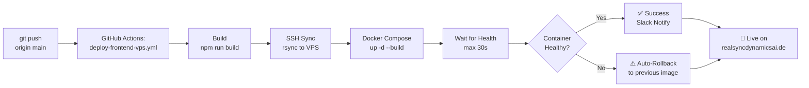

# 🚀 VPS Deployment Complete Setup Guide

**Target:** realsyncdynamicsai.de (187.77.89.1 / srv1622293)  
**Stack:** React 19 + Vite 6.2 → Docker → nginx:alpine → Traefik/Host-nginx  
**Status:** Production-Ready with Auto-Rollback, Slack Notifications, Health Checks  

---

## 📋 Overview

This guide takes you through **3 main steps**:

| Step | Task | Duration | Tool |
|------|------|----------|------|
| **1** | Verify GitHub Secrets | 2 min | Manual check |
| **2** | Prepare VPS | 5-10 min | `vps-setup.sh` |
| **3** | Test Deployment | 3-5 min | `smoke-test-vps.sh` |

**Outcome:** Automated deployment on `git push → main`

---

## 🔐 Step 1: Verify GitHub Secrets

Your repository already has these secrets configured:

```
✅ VITE_SUPABASE_URL
✅ VITE_SUPABASE_ANON_KEY
✅ VPS_SSH_HOST (187.77.89.1)
✅ VPS_SSH_USER (root)
✅ VPS_SSH_KEY
✅ VPS_SSH_KNOWN_HOST
```

### Verify in GitHub

1. Go: **Repository → Settings → Secrets and variables → Actions**
2. Confirm all 6 secrets are listed (✅ means they exist, values are hidden)
3. If any are missing, add them:
   - `VITE_SUPABASE_URL` = Your Supabase Project URL
   - `VITE_SUPABASE_ANON_KEY` = Your Supabase Anon Key
   - etc.

**Status:** ✅ All secrets present

---

## 🛠️ Step 2: Prepare VPS

Run this command on your VPS:

```bash
# SSH into VPS
ssh root@187.77.89.1

# Download and run setup script
curl -fsSL https://raw.githubusercontent.com/realsyncdynamics-spec/RealSyncDynamics.AI/claude/vps-deployment-setup-eq366f/deploy/vps-setup.sh | bash

# Or locally:
bash vps-setup.sh
```

### What the script does:

1. ✅ Verifies Docker & Docker Compose V2
2. ✅ Creates `/var/www/realsyncdynamicsai-frontend`
3. ✅ Clones your repository
4. ✅ Creates `.env` template
5. ✅ Checks port availability
6. ✅ (Optional) Test Docker build

### After the script:

Edit the `.env` file with your actual Supabase values:

```bash
# On VPS, after setup script completes:
nano /var/www/realsyncdynamicsai-frontend/deploy/frontend-vps-deploy-v2/.env

# Update these values:
VITE_SUPABASE_URL="https://your-project.supabase.co"
VITE_SUPABASE_ANON_KEY="eyJhbGciOiJIUzI1NiIsInR5cCI6IkpXVCJ9..."

# Save & exit (Ctrl+X, Y, Enter)
```

**Status:** ✅ VPS ready for deployment

---

## 🧪 Step 3: Test Deployment

### Option A: Automatic Deployment (Recommended)

Just push to `main`:

```bash
# Local development machine
git push origin main

# GitHub Actions automatically:
# 1. Builds frontend
# 2. Syncs to VPS via rsync
# 3. Runs: docker compose up -d --build
# 4. Waits for health check
# 5. Posts Slack notification (if configured)
# 6. Auto-rollback on failure
```

**Watch the deployment:**
- GitHub: https://github.com/realsyncdynamics-spec/RealSyncDynamics.AI/actions
- VPS: `docker compose logs -f`

---

### Option B: Manual Deployment (for specific testing)

Trigger the manual workflow:

1. Go: GitHub → **Actions → "Deploy Frontend to Production (Manual)"**
2. Click **"Run workflow"**
3. Select environment: `production`
4. Monitor logs

---

### Option C: Local VPS Test (no GitHub)

Test manually on the VPS without GitHub Actions:

```bash
# SSH into VPS
ssh root@187.77.89.1

# Navigate to deployment directory
cd /var/www/realsyncdynamicsai-frontend/deploy/frontend-vps-deploy-v2

# Build and start
docker compose --env-file .env up -d --build

# Monitor build (takes ~1-2 minutes)
docker compose logs -f frontend

# After it says "healthy", test:
curl http://127.0.0.1:8090/healthz
# Should return: ok
```

---

## ✅ Verify Deployment

After deployment completes, run the smoke test:

```bash
# On VPS
bash /var/www/realsyncdynamicsai-frontend/deploy/smoke-test-vps.sh

# Checks:
# - Container running & healthy
# - Health endpoint responds
# - Main page loads
# - Security headers present
# - Response time acceptable
# - No errors in logs
```

Expected output:

```
✅ Container is running and healthy
✅ Health endpoint responds
✅ Main page loads: HTTP 200
✅ Assets path responds
✅ Security headers present
✅ Fast response: 120ms
⚠️  Public URL not reachable (expected before reverse-proxy setup)
✅ No errors in recent logs

Summary
Passed:  7
Warnings: 1
Failed:  0

✅ All tests passed! Frontend is healthy.
```

---

## 📊 Deployment Workflow

### Automatic Deployment (on `git push → main`)



**Timeline:**
- GitHub build: ~60s
- VPS sync: ~10s
- Docker build: ~40s
- Health check: ~10-30s
- **Total: 2-3 minutes**

---

## 🔄 Rollback Procedures

### Automatic Rollback

Triggered automatically if:
- Docker build fails
- Health check fails
- Container crashes

The previous working image (tagged `realsync-frontend:previous`) is automatically restored.

### Manual Rollback

If you need to manually rollback:

```bash
# SSH into VPS
ssh root@187.77.89.1

cd /var/www/realsyncdynamicsai-frontend/deploy/frontend-vps-deploy-v2

# List available images
docker image ls | grep realsync-frontend

# Restore previous version
docker image tag realsync-frontend:previous realsync-frontend:latest
docker compose --env-file .env up -d

# Verify
docker compose ps
curl http://127.0.0.1:8090/healthz
```

---

## 📝 Logs & Monitoring

### View Deployment Logs

```bash
# GitHub Actions workflow logs
gh run list --workflow deploy-frontend-vps.yml
gh run view <run-id> --log

# Or via web: GitHub → Actions → specific workflow run
```

### View Container Logs

```bash
# SSH into VPS
ssh root@187.77.89.1

cd /var/www/realsyncdynamicsai-frontend/deploy/frontend-vps-deploy-v2

# Live logs
docker compose logs -f frontend

# Last 100 lines
docker compose logs --tail=100 frontend

# With timestamps
docker compose logs --timestamps frontend
```

### Check Container Status

```bash
# Quick status
docker compose ps

# Detailed inspection
docker inspect realsync-frontend

# Health status specifically
docker inspect -f '{{.State.Health.Status}}' realsync-frontend
```

---

## 🔧 Troubleshooting

### Docker build fails

**Error:** `npm ERR! ...` during build

```bash
# Check Docker disk space
docker system df

# Clean up old images
docker image prune -a --force

# Rebuild with verbose output
docker compose --env-file .env build --no-cache --progress=plain 2>&1 | tail -50
```

**Most common:** Missing or invalid `VITE_SUPABASE_URL` in `.env`

```bash
# Verify .env
cat /var/www/realsyncdynamicsai-frontend/deploy/frontend-vps-deploy-v2/.env

# Edit if needed
nano /var/www/realsyncdynamicsai-frontend/deploy/frontend-vps-deploy-v2/.env
```

---

### Health check fails

**Error:** Container unhealthy after 30s

```bash
# Check nginx config
docker exec realsync-frontend nginx -t

# Test health endpoint manually
docker exec realsync-frontend wget -qO- http://127.0.0.1/healthz

# View nginx error logs
docker exec realsync-frontend cat /var/log/nginx/error.log

# Check main logs
docker compose logs --tail=50 frontend
```

---

### Port already in use

**Error:** `bind: address already in use`

```bash
# Check what's using port 8090
lsof -i :8090
netstat -tlnp | grep 8090

# Options:
# 1. Stop the conflicting service
# 2. Or change FRONTEND_HOST_PORT in .env to 8091, 8092, etc.
```

---

### Container keeps restarting

**Error:** `docker compose ps` shows `Restarting (1) 10 seconds ago`

```bash
# Check restart policy
docker inspect realsync-frontend | grep -A5 RestartPolicy

# View full logs
docker compose logs frontend

# Common causes:
# - Build failed (npm errors)
# - Missing environment variables
# - Invalid Supabase credentials
```

---

## 🛡️ Security Checklist

- [ ] `.env` file on VPS has `chmod 600` (owner only)
- [ ] SSH private key used only in GitHub Secrets
- [ ] Supabase anon key is correct (client-safe)
- [ ] No secrets in git history (`git log --all -p | grep VITE_`)
- [ ] VPS firewall allows SSH only from known IPs
- [ ] Reverse-proxy (Traefik/nginx) configured before public exposure
- [ ] HTTPS/TLS termination at reverse-proxy level
- [ ] Sentry DSN is correct (error tracking)
- [ ] Slack webhook is secret (if using notifications)

---

## 📈 Performance Notes

### Build Metrics

| Component | Time |
|-----------|------|
| npm ci | ~30s |
| Vite build | ~15s |
| Docker layer cache | Cached layers reuse |
| rsync to VPS | ~10s |
| Docker build on VPS | ~40s (first run), ~5s (cached) |
| Health check wait | ~10-30s |
| **Total** | **2-3 minutes** |

### Runtime Metrics

| Metric | Value |
|--------|-------|
| Container memory | ~200MB avg, ~500MB peak |
| Container CPU | idle most of time, spikes on requests |
| Disk usage | ~500MB (node_modules + build) |
| Response time | <200ms typical |
| Health check interval | 30s |

---

## 🔗 Integration with Reverse-Proxy

The container runs on `127.0.0.1:8090` (local only, secure by default).

### Traefik Setup (if using Traefik)

Add labels to `docker-compose.yml`:

```yaml
services:
  frontend:
    # ... existing config ...
    labels:
      - "traefik.enable=true"
      - "traefik.http.routers.frontend.rule=Host(`realsyncdynamicsai.de`)"
      - "traefik.http.routers.frontend.entrypoints=web,websecure"
      - "traefik.http.routers.frontend.tls.certresolver=letsencrypt"
      - "traefik.http.services.frontend.loadbalancer.server.port=80"
```

### Host Nginx Setup

In your host nginx config (`/etc/nginx/sites-available/realsyncdynamicsai.de`):

```nginx
location / {
    proxy_pass http://127.0.0.1:8090;
    proxy_http_version 1.1;
    proxy_set_header Host $host;
    proxy_set_header X-Real-IP $remote_addr;
    proxy_set_header X-Forwarded-For $proxy_add_x_forwarded_for;
    proxy_set_header X-Forwarded-Proto $scheme;
}
```

---

## 📞 Next Steps

1. ✅ **Verify Secrets** (already done)
2. ✅ **Run vps-setup.sh** on VPS
3. ✅ **Test Deployment** via git push or manual workflow
4. ✅ **Run smoke-test-vps.sh** to verify
5. ⏭️ **Set up Reverse-Proxy** (Traefik/nginx) for public access
6. ⏭️ **(Optional) Configure Slack** notifications in GitHub Secrets
7. ⏭️ **Monitor in Production** via Sentry + GitHub Actions

---

## 📚 Additional Resources

- **Full Runbook:** `deploy/DEPLOYMENT_RUNBOOK.md`
- **GitHub Workflows:** `.github/workflows/deploy-frontend-vps*.yml`
- **Docker Config:** `Dockerfile.frontend`, `deploy/frontend-vps-deploy-v2/docker-compose.yml`
- **Nginx Config:** `deploy/frontend-vps-deploy-v2/nginx.conf`

---

**Questions?** Check the `DEPLOYMENT_RUNBOOK.md` or review workflow logs in GitHub Actions.

**Ready to deploy?** → `git push origin main` 🚀
