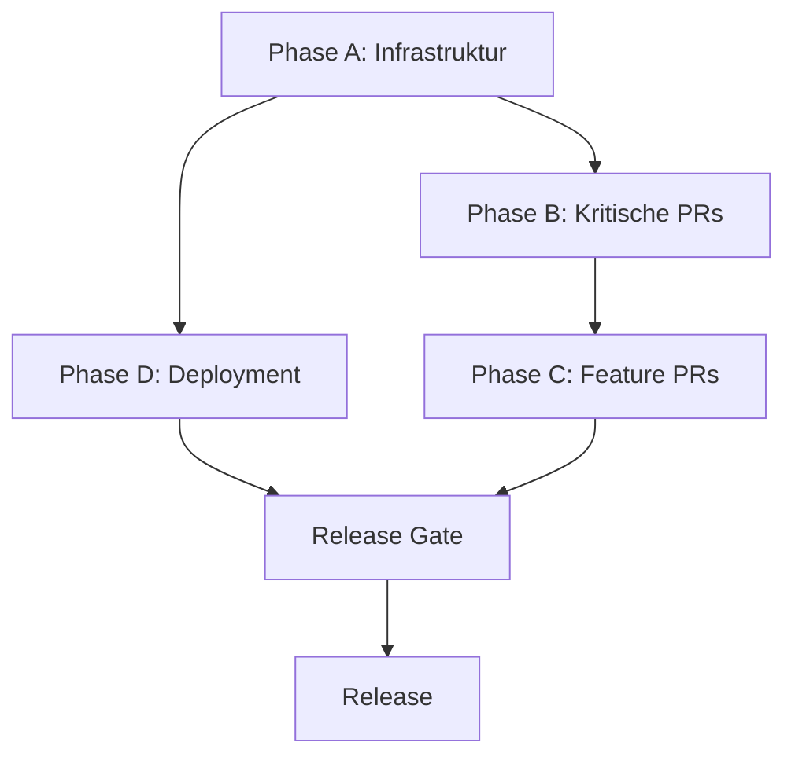

# Release Checkliste

**Zweck:** Phasenbasierte Release-Vorbereitung mit klaren Abhängigkeiten

---

## Übersicht

Diese Checkliste ist in Phasen unterteilt, um sicherzustellen, dass Infrastrukturänderungen nicht von späteren PRs überholt werden.

---

## Phase A: Infrastruktur-Grundlagen

*Priorität: HOCH - Muss vor allen anderen Phasen abgeschlossen werden*

- [ ] **Repository-Zugriff**
  - [ ] Admin-Rechte für Release-Manager
  - [ ] Maintain-Rechte für Core-Team
  - [ ] Read-Rechte für alle Entwickler
  - [ ] Zugriff für CI/CD-Bot

- [ ] **Branch Protection**
  - [ ] main-Branch geschützt
  - [ ] Required Reviews: 2
  - [ ] Required Status Checks: CI/CD
  - [ ] Admin Bypass deaktiviert

- [ ] **Secrets**
  - [ ] Alle Required Secrets in CI/CD konfiguriert
  - [ ] Secrets rotiert (falls nötig)
  - [ ] Zugriffsbeschränkungen gesetzt
  - [ ] Backup der Secrets erstellt

- [ ] **Environments**
  - [ ] Production Environment konfiguriert
  - [ ] Staging Environment konfiguriert
  - [ ] Development Environment konfiguriert
  - [ ] Environment Protection Rules gesetzt

---

## Phase B: Kritische Infrastruktur-PRs

*Priorität: HOCH - Blockieren Release-Vorbereitung*

- [ ] **PR #897** - [BESCHREIBUNG]
  - [ ] Code Review abgeschlossen
  - [ ] Tests passieren
  - [ ] Merge-Kriterien erfüllt
  - [ ] Gemergt

- [ ] **PR #902** - [BESCHREIBUNG]
  - [ ] Code Review abgeschlossen
  - [ ] Tests passieren
  - [ ] Merge-Kriterien erfüllt
  - [ ] Gemergt

---

## Phase C: Wichtige Feature-PRs

*Priorität: MITTEL - Sollten vor Release abgeschlossen werden*

- [ ] **PR #896** - [BESCHREIBUNG]
  - [ ] Code Review abgeschlossen
  - [ ] Tests passieren
  - [ ] Merge-Kriterien erfüllt
  - [ ] Gemergt

- [ ] **PR #905** - [BESCHREIBUNG]
  - [ ] Code Review abgeschlossen
  - [ ] Tests passieren
  - [ ] Merge-Kriterien erfüllt
  - [ ] Gemergt

---

## Phase D: Deployment & Monitoring

*Priorität: MITTEL - Können parallel zu Phase C bearbeitet werden*

- [ ] **Domain**
  - [ ] DNS-Konfiguration abgeschlossen
  - [ ] SSL-Zertifikat installiert
  - [ ] Domain-Propagation verifiziert
  - [ ] Redirects konfiguriert

- [ ] **Monitoring**
  - [ ] Sentry konfiguriert
  - [ ] Logging aktiviert
  - [ ] Alert Rules definiert
  - [ ] Dashboard eingerichtet

- [ ] **Release**
  - [ ] Release-Tag erstellt
  - [ ] Changelog aktualisiert
  - [ ] Version gebumpt
  - [ ] Release Notes vorbereitet

---

## Release Gate

*Vor dem Merge der letzten kritischen PR - alle Punkte müssen erfüllt sein*

- [ ] CI grün
- [ ] Smoke Tests bestanden
- [ ] Secrets vorhanden
- [ ] Branch Protection aktiv
- [ ] Domain erreichbar
- [ ] Monitoring aktiv
- [ ] Rollback dokumentiert

---

## Rollback-Plan

Für jede kritische PR muss ein Rollback-Plan dokumentiert sein:

### Rollback-Optionen

- [ ] **Revert Commit**
  - [ ] Revert Commit vorbereitet
  - [ ] Getestet in Staging
  - [ ] Dokumentation vorhanden

- [ ] **GitHub Revert PR**
  - [ ] Revert PR erstellt
  - [ ] Review abgeschlossen
  - [ ] Merge-Bereit

### Rollback-Verantwortliche

| PR | Rollback-Verantwortlicher | Kontakt |
|----|---------------------------|---------|
| #897 | [NAME] | [KONTAKT] |
| #902 | [NAME] | [KONTAKT] |
| #896 | [NAME] | [KONTAKT] |
| #905 | [NAME] | [KONTAKT] |

---

## Release Outcome (fachliches Ziel)

Nach Abschluss der Phase 5 soll die Plattform den End-to-End-Workflow ohne Demo-Brüche abbilden:

### Workflow: Discover → Classify → Enforce → Prove

### Erfolgskriterien

- [ ] **Website Discovery**
  - [ ] Automatische Erkennung von Websites
  - [ ] Metadata-Extraktion
  - [ ] Content-Klassifizierung

- [ ] **AI System Register**
  - [ ] AI-Systeme erfassbar
  - [ ] Modell-Informationen speicherbar
  - [ ] Use-Case-Dokumentation

- [ ] **Vendor Register**
  - [ ] Anbieter erfassbar
  - [ ] Vertragsinformationen speicherbar
  - [ ] Compliance-Status trackbar

- [ ] **Risk Register**
  - [ ] Risiken identifizierbar
  - [ ] Bewertung möglich
  - [ ] Mitigationsmaßnahmen dokumentierbar

- [ ] **Evidence Vault**
  - [ ] Beweismittel speicherbar
  - [ ] Versionierung aktiv
  - [ ] Integrität gesichert

- [ ] **Audit Export**
  - [ ] PDF-Export funktioniert
  - [ ] Alle Daten enthalten
  - [ ] Auditor-freundliches Format

- [ ] **Runtime Monitoring**
  - [ ] Echtzeit-Überwachung aktiv
  - [ ] Alerts funktionieren
  - [ ] Dashboard verfügbar

---

## Abhängigkeiten

---

## Verantwortlichkeiten

| Phase | Verantwortlicher | Support |
|-------|------------------|---------|
| Phase A | [NAME] | [TEAM] |
| Phase B | [NAME] | [TEAM] |
| Phase C | [NAME] | [TEAM] |
| Phase D | [NAME] | [TEAM] |
| Release Gate | [NAME] | [TEAM] |

---

## Zeitplan

| Phase | Start | Ende | Dauer |
|-------|-------|------|-------|
| Phase A | [DATUM] | [DATUM] | [DAUER] |
| Phase B | [DATUM] | [DATUM] | [DAUER] |
| Phase C | [DATUM] | [DATUM] | [DAUER] |
| Phase D | [DATUM] | [DATUM] | [DAUER] |
| Release | [DATUM] | [DATUM] | [DAUER] |

---

**Version:** 1.0  
**Letzte Aktualisierung:** 2026-07-29  
**Verantwortlich:** Engineering Team
