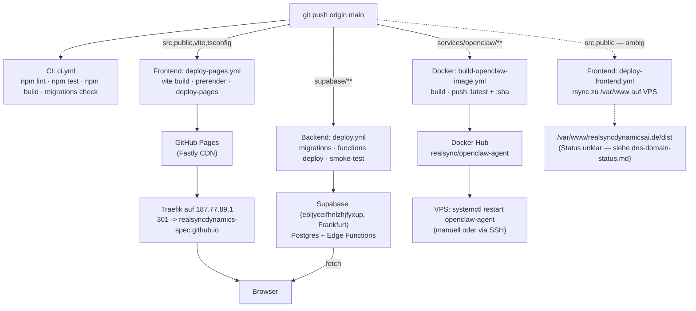

# Deployment Chain — RealSyncDynamics.AI

**Erstellt:** 2026-05-26
**Modus:** Read-only Inventur der `.github/workflows/*` und Deploy-Skripte. Kein Trigger, kein Push, kein Service-Restart.

---

## 1. Topologie auf einen Blick



---

## 2. Pipelines im Detail

### 2.1 `ci.yml` — Build + Tests

| Aspekt | Wert |
|---|---|
| Trigger | `pull_request` und `push` auf `main` |
| Steps | `npm ci`, `npm run lint`, `npm test`, `npm run build`, Migration-Append-Only-Check, Postgres-15-Migrationen-Apply-Check |
| Secrets | keine |
| Healthcheck | Tests + Build-Erfolg = Job-Erfolg |
| Rollback | nicht anwendbar (kein Deploy) |
| Status | aktiv, blockiert Merge bei Fehlern |

### 2.2 `deploy-pages.yml` — Frontend → GitHub Pages

| Aspekt | Wert |
|---|---|
| Trigger | `push` auf `main`, Pfade `src/**`, `public/**`, `index.html`, `package*.json`, `vite.config.ts`, `tsconfig.json`, `.github/workflows/deploy-pages.yml`; plus `workflow_dispatch` |
| Steps | `npm ci`, `npm run build` (mit `VITE_BASE=/`), Playwright Chromium installieren, `npm run prerender`, Python-SPA-Fallback, `actions/upload-pages-artifact`, `actions/deploy-pages` |
| Secrets | `VITE_SUPABASE_URL`, `VITE_SUPABASE_ANON_KEY` |
| Deploy-Ziel | `realsyncdynamics-spec.github.io/RealSyncDynamics.AI/` |
| Endpoint | `realsyncdynamicsai.de` (via Traefik-301-Redirect) |
| Healthcheck | impliziter `actions/deploy-pages`-Status |
| Rollback | manuell: Git revert + Re-Push (~3 min Lag) |
| Status | aktiv, canonical |

### 2.3 `deploy.yml` — Supabase Migrations + Edge Functions

Zwei parallele Jobs:

**Job `db-push`:**
- `supabase link --project-ref $PROJECT_ID`
- `supabase migration repair --status reverted <110+ feste IDs>` (Cleanup aus frueheren Faillauten)
- `supabase migration repair --status applied <~80 weitere IDs>`
- `supabase migration list --linked`
- `supabase db push --include-all`

**Job `functions-deploy`:**
- Parsen `supabase/config.toml`, ermitteln aller `verify_jwt = false`-Funktionen
- Loop ueber `supabase/functions/*/`, `supabase functions deploy <fn>` (mit/ohne `--no-verify-jwt`)
- Smoke-Tests: POST `/gdpr-audit` mit ungueltiger URL muss HTTP 400 liefern (nicht 401)

| Aspekt | Wert |
|---|---|
| Trigger | `push` auf `main`, Pfade `supabase/**`; `workflow_dispatch` mit optionalem `deploy_functions`-Flag |
| Secrets | `SUPABASE_ACCESS_TOKEN`, `SUPABASE_PROJECT_ID`, `SUPABASE_DB_PASSWORD` |
| Deploy-Ziel | Supabase Project `ebljyceifhnlzhjfyxup` (Frankfurt, `eu-central-1`) |
| Healthcheck | Smoke-Test `gdpr-audit` und `cookie-scan` mit Validation-Fehler → 400 |
| Rollback | nicht automatisiert. Migrationen: neue forward-only-Revert-Migration. Functions: Git-Revert + Re-Deploy |
| Status | aktiv |

**Hinweis zur Migration-Repair-Liste:** Die ~190 hardcoded Migration-IDs in `deploy.yml` sind ein Workaround fuer historische Fehl-Apply-Versuche. Sobald die Production-DB einen sauberen State hat, sollte die Liste auf 0 schrumpfen. Aktuell wird die Liste bei jedem Deploy mit verarbeitet.

### 2.4 `build-openclaw-image.yml` — OpenClaw Image → Docker Hub

| Aspekt | Wert |
|---|---|
| Trigger | `push` auf `main`, Pfade `services/openclaw-agent/**` und der Workflow selbst; `workflow_dispatch` |
| Steps | Buildx setup, Docker-Hub-Login, Build aus `services/openclaw-agent/Dockerfile`, Push als `:latest` und `:<sha7>` |
| Secrets | `DOCKER_HUB_USERNAME`, `DOCKER_HUB_TOKEN` |
| Deploy-Ziel | Docker Hub `realsync/openclaw-agent:{latest,<sha7>}` |
| Healthcheck | nur Push-Erfolg, kein Funktionstest |
| Rollback | manuell: auf VPS `docker pull realsync/openclaw-agent:<aelterer-sha>` + `systemctl restart openclaw-agent` |
| Status | Workflow eingefuehrt in PR #402, blockiert auf Repo-Secrets-Setzung |

Der `systemd`-Service auf der VPS (`/etc/systemd/system/openclaw-agent.service`) ruft bei jedem Restart `docker pull realsync/openclaw-agent:latest` auf. Damit gibt es zwischen "Image gepusht" und "Service neu gezogen" eine **manuelle Luecke**: niemand macht den `systemctl restart` automatisch nach erfolgreichem Push. Operator muss SSH-en.

### 2.5 `deploy-frontend.yml` — Frontend → VPS (Status unklar)

| Aspekt | Wert |
|---|---|
| Trigger | `push` auf `main`, Pfade `src/**`, `public/**`, etc.; `workflow_dispatch` |
| Steps | `npm ci`, build, prerender, SSH-Setup, `rsync` zu `${VPS_SSH_USER}@${VPS_SSH_HOST}:${VPS_FRONTEND_PATH}/`, `curl`-Smoke-Test mit 5 Retries auf `https://realsyncdynamicsai.de/` |
| Secrets | `VPS_SSH_HOST`, `VPS_SSH_USER`, `VPS_SSH_KEY`, `VPS_SSH_KNOWN_HOST`, `VPS_FRONTEND_PATH`, `VITE_SUPABASE_URL`, `VITE_SUPABASE_ANON_KEY` |
| Deploy-Ziel | `/var/www/realsyncdynamicsai.de/dist` auf VPS |
| Healthcheck | `curl -fsSL https://realsyncdynamicsai.de/` retry-fuenfmal |
| Rollback | manuell: rsync mit alter Build-Version |
| Status | **Status unklar.** Der Smoke-Test erwartet HTTP 200 von `realsyncdynamicsai.de`, aber dieselbe URL bekommt vermutlich einen 301 von Traefik zu GitHub Pages. → Siehe `dns-domain-status.md` §5.1 |

### 2.6 `vps-backup.yml` — Daily Backup

| Aspekt | Wert |
|---|---|
| Trigger | Cron `17 3 * * *` (03:17 UTC) plus `workflow_dispatch` |
| Steps | SSH-Setup, scp `scripts/vps-backup.sh` auf VPS, ssh-execute |
| Backup-Ziel | `/var/backups/realsyncdynamicsai/` auf demselben VPS, 7-Tage-Rotation |
| Secrets | `VPS_SSH_*` |
| Healthcheck | Skript-Exit-Code |
| Rollback | nicht anwendbar |
| Status | aktiv, **kein Off-Site-Backup** (nur lokal auf VPS — bei VPS-Verlust auch Backup weg) |

### 2.7 `tracker-db-update.yml` — Wochen-Cron

| Aspekt | Wert |
|---|---|
| Trigger | Cron `0 6 * * 4` (Donnerstag 06:00 UTC) |
| Steps | EasyList-Last-Modified abfragen, `public/tracker-db-version.json` schreiben, commit + push auf `main` (triggert dadurch `deploy-pages.yml`) |
| Secrets | keine |
| Status | aktiv |

### 2.8 `pre-deploy-check.yml` — PR-Lint

| Aspekt | Wert |
|---|---|
| Trigger | `pull_request` auf `main`, Pfade `supabase/**`, `src/runtime/agents/**` |
| Steps | `scripts/pre-deploy-lint.mjs` (Dead `[functions.X]`-Config, Migration-Timestamp-Order, Functions ohne Config-Entry, Agent-Contract-Violations) |
| Secrets | keine |
| Status | aktiv, blockiert PR-Merge bei Fehlern |

### 2.9 `e2e.yml` — Playwright

| Aspekt | Wert |
|---|---|
| Trigger | `pull_request` + `push` auf `main`, Pfade `src/**`, `public/**` |
| Steps | Playwright in offiziellem Container, `npx playwright test`, Artifacts on failure |
| Secrets | keine |
| Status | aktiv |

### 2.10 `ssh-setup.yml` — Manual Helper

| Aspekt | Wert |
|---|---|
| Trigger | `workflow_dispatch` only |
| Output | Generiert ed25519-Keypair + `ssh-keyscan` Output, schreibt beides in Step-Summary |
| Zweck | Operator-Hilfsmittel zum Rotieren von Deploy-Credentials |

---

## 3. Secrets-Inventar

| Secret | Pipelines | Verwendung |
|---|---|---|
| `VITE_SUPABASE_URL` | `deploy-pages.yml`, `deploy-frontend.yml` | gebakt ins Frontend-Bundle |
| `VITE_SUPABASE_ANON_KEY` | `deploy-pages.yml`, `deploy-frontend.yml` | gebakt ins Frontend-Bundle |
| `SUPABASE_ACCESS_TOKEN` | `deploy.yml` | CLI-Auth |
| `SUPABASE_PROJECT_ID` | `deploy.yml` | Link-Target |
| `SUPABASE_DB_PASSWORD` | `deploy.yml` | DB-Push |
| `VPS_SSH_HOST`, `VPS_SSH_USER`, `VPS_SSH_KEY`, `VPS_SSH_KNOWN_HOST`, `VPS_FRONTEND_PATH` | `deploy-frontend.yml`, `vps-backup.yml` | SSH zum VPS |
| `DOCKER_HUB_USERNAME`, `DOCKER_HUB_TOKEN` | `build-openclaw-image.yml` | Docker-Hub-Login |

Alle GitHub-Repo-Secrets sind global ueber alle Workflows zugaenglich. Es gibt keine Environment-Trennung (kein `staging` Environment in GitHub-Actions-Settings). → Aenderung eines Secrets wirkt sofort auf Production.

---

## 4. Gaps in der Deploy-Kette

| # | Gap | Risiko | Wo dokumentiert |
|---|---|---|---|
| 1 | Kein automatischer Migration-Rollback | Fehler in `supabase/migrations/*.sql` ist 3-5 min live, bis Forward-only-Revert gemerged + deployed | `deployment-chain.md` §2.3 |
| 2 | Edge-Functions-Smoke-Test nur fuer 2 Functions (`gdpr-audit`, `cookie-scan`) | Bricht eine der ~66 anderen Functions, faellt's erst auf, wenn ein User sie aufruft | `deployment-chain.md` §2.3 |
| 3 | Docker-Hub-Push → kein automatischer `systemctl restart openclaw-agent` | Image liegt da, Service laeuft noch auf altem Stand bis manuell SSH | `deployment-chain.md` §2.4 |
| 4 | `deploy-frontend.yml` rsync-Pfad: unklar ob Ziel ueberhaupt serviert wird | "Erfolgreich deployed" ohne dass der Code live geht | `dns-domain-status.md` §5.1 |
| 5 | Kein Off-Site-Backup | VPS-Verlust = 7-Tage-Daten-Verlust | `deployment-chain.md` §2.6 |
| 6 | Kein Staging | Jeder Bug auf `main` ist Production-Bug | `dns-domain-status.md` §4 |
| 7 | Migration-Repair-Liste in `deploy.yml` waechst | ~190 hardcoded Migration-IDs sind Workaround. Wenn DB-State driftet, wird die Liste schlechter wartbar | `deployment-chain.md` §2.3 |
| 8 | Keine Healthcheck-Definition fuer Edge-Functions im Repo | Smoke-Test schaut nur, ob 400-Validation greift — nicht ob die Function ueberhaupt sinnvoll antwortet | `deployment-chain.md` §2.3 |
| 9 | Secrets nicht rotiert | Alle Secrets sind statisch, kein Rotations-Workflow im Repo | `deployment-chain.md` §3 |
| 10 | Kein zentraler "Deploy-Erfolg" Status-Endpoint | Bei drei parallelen Workflows ist nicht trivial sichtbar, ob "alles ist gruen" | `deployment-chain.md` §1 |

---

## 5. Sequenz nach `git push main` (best case)

```
T+0s     git push origin main
T+1s     GitHub-Webhook → Actions-Runner-Spawn
T+5s     CI Job startet
T+30s    CI: lint + test fertig
T+90s    CI: build fertig + Migration-Validation gruen → PR mergebar
T+90s    deploy-pages startet parallel
T+150s   deploy-pages: vite build + prerender fertig
T+180s   deploy-pages: artifact uploaded
T+210s   deploy-pages: GitHub Pages aktiv
T+90s    deploy.yml startet parallel (falls supabase/** im Diff)
T+150s   deploy.yml: db-push fertig
T+180s   deploy.yml: functions-deploy + Smoke-Test fertig
T+90s    build-openclaw-image startet parallel (falls services/openclaw-agent/** im Diff)
T+180s   build-openclaw-image: Push fertig
         → manueller Schritt: SSH zu VPS + `systemctl restart openclaw-agent`
```

Worst case (Migration-Repair-Liste muss verarbeitet werden, Repository ist stark): bis ~6 Minuten.

---

## 6. Rollback-Matrix

| Komponente | Rollback-Pfad | Geschaetzte MTTR |
|---|---|---|
| Frontend (GitHub Pages) | Git revert + push, Workflow laeuft erneut | ~3 min |
| Frontend (VPS rsync) | Re-rsync alter Build, falls geziehlt | ~5 min, manuell |
| Supabase Migration | Neue Forward-only-Revert-Migration schreiben + mergen | 10-30 min |
| Supabase Edge-Function | Git revert + push, Workflow re-deployt alle Functions | ~5 min |
| OpenClaw Image | SSH zu VPS, `docker pull realsync/openclaw-agent:<alter-sha>`, `systemctl restart` | ~3 min, manuell |
| Secrets-Rotation | Manuell in GitHub-Settings + ggf. auf VPS | 10-15 min |

Keiner dieser Pfade ist mit einem "Big Red Button" automatisiert. Alle erfordern menschliche Aktion.

---

## 7. Keine Aenderungen aus dieser Analyse

Dieses Dokument ist Read-Only-Inventur. Aenderungen an Workflows, Secrets oder Rollback-Strategie erfolgen erst nach Operator-Diskussion und in separaten PRs.
