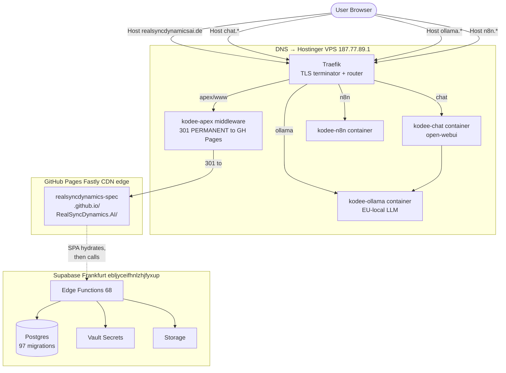
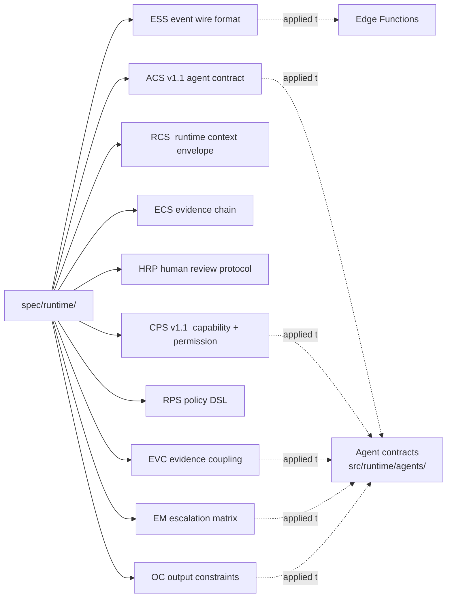

# Deployment Topology

Companion to [`production-runtime.md`](production-runtime.md). The diagrams below render as Mermaid in any GitHub-flavoured markdown viewer.

---

## End-to-end request path



---

## CI / CD pipelines

```mermaid
flowchart LR
    Dev[Developer push to main]

    Dev -- "src/**, public/**, vite.config.ts, etc." --> CI[CI workflow<br/>lint + test + build]
    Dev -- "src/**, public/**, ..." --> Pages[deploy-pages.yml<br/>**CANONICAL FRONTEND**]
    Dev -- "src/**, public/**, ... (same trigger)" --> VPS[deploy-frontend.yml<br/>STATUS AMBIGUOUS]
    Dev -- "supabase/migrations/**, supabase/functions/**, supabase/config.toml" --> Supa[deploy.yml<br/>migrations + functions]
    Dev -- "src/**, public/**, e2e/**, ..." --> E2E[e2e.yml<br/>Playwright smoke]

    Pages --> GHPages[GitHub Pages<br/>artifact at gh-pages branch]
    VPS --> VPSdir[/var/www/realsyncdynamicsai.de/dist<br/>on the VPS<br/>NOT served by Traefik]
    Supa --> Sb[(Supabase project<br/>ebljyceifhnlzhjfyxup)]

    Periodic[Cron tracker-db-update.yml<br/>every 24 h] --> Supa
    Backup[vps-backup.yml] --> VPSbackup[(VPS backup vault)]
```

---

## Secrets matrix

```mermaid
flowchart TB
    GHSecrets[GitHub Actions Secrets]
    SupaVault[Supabase Vault]
    EnvFunc[Edge Function Env]

    GHSecrets --> A1[VITE_SUPABASE_URL<br/>baked into bundle]
    GHSecrets --> A2[VITE_SUPABASE_ANON_KEY<br/>baked into bundle]
    GHSecrets --> A3[SUPABASE_ACCESS_TOKEN<br/>used by deploy.yml]
    GHSecrets --> A4[SUPABASE_PROJECT_ID<br/>used by deploy.yml]
    GHSecrets --> A5[SUPABASE_DB_PASSWORD<br/>used by deploy.yml]
    GHSecrets --> A6[VPS_SSH_KEY + VPS_SSH_HOST + VPS_SSH_USER<br/>used by deploy-frontend.yml + ssh-setup.yml]

    SupaVault --> B1[OPENAI_API_KEY]
    SupaVault --> B2[ANTHROPIC_API_KEY]
    SupaVault --> B3[STRIPE_SECRET_KEY]
    SupaVault --> B4[STRIPE_WEBHOOK_SECRET]
    SupaVault --> B5[RESEND_API_KEY / POSTMARK_API_TOKEN]

    EnvFunc --> C1[LM_STUDIO_BASE_URL / LM_STUDIO_API_KEY<br/>fallback path before Vault lookup]
    EnvFunc --> C2[AI_GATEWAY_IP_HASH_SALT<br/>rate-limit per IP]
    EnvFunc --> C3[AGENT_LLM_PROVIDER / AGENT_LLM_MODEL]
```



---

## Runtime spec — where the contracts live



---

## Failure modes by surface

| Failure | Symptom | Detection | Mitigation |
|---|---|---|---|
| GitHub Pages deploy times out | Stale frontend at `realsyncdynamicsai.de` | `npm run check:production` returns last-modified > 1 day | Re-run last successful `deploy-pages.yml` |
| Supabase migrations conflict | `db push` fails in `deploy.yml` | Workflow run goes red | Inspect `repair --status reverted` list in `deploy.yml`, add the offending migration ID |
| Edge function 401 after deploy | Public functions inaccessible | `deploy.yml` smoke checks fail | `verify_jwt = false` config didn't apply — re-run deploy with `deploy_functions=true` |
| Traefik certificate renewal stalls | apex 301 returns wrong-cert error | Browser shows cert warning | SSH to VPS, `docker compose restart traefik` |
| VPS sub-services down (chat, ollama, n8n) | Subdomain returns 502 | manual `curl https://chat.realsyncdynamicsai.de` | SSH to VPS, `docker compose ps`, `docker compose logs <service>` |
| Supabase project paused (billing) | All Edge Function calls return 503 | Sentry / direct curl | Restore in Supabase dashboard |

---

## Open architectural questions

These are documented in [`production-runtime.md`](production-runtime.md) §"Ambiguous artifacts" and require an operator decision before any cleanup PR can land:

1. Is `deploy-frontend.yml` shipping to a path that any production surface actually reads? If not, the workflow + the nginx vhost file should be deleted.
2. Should the GitHub Pages URL `realsyncdynamics-spec.github.io/RealSyncDynamics.AI/` continue to be referenced in customer-facing PDFs (`pitch-deck-pdf`) and outreach templates, or should those references be migrated to the apex `realsyncdynamicsai.de`?
3. The Traefik apex-redirect to GH Pages is a 301 PERMANENT — that means browser caches the redirect aggressively. If the apex ever needs to serve different content (e.g., a future migration), an operator first needs to flip the redirect to 302 and let caches expire before flipping again. This is a documented operational hazard, not a code change.
